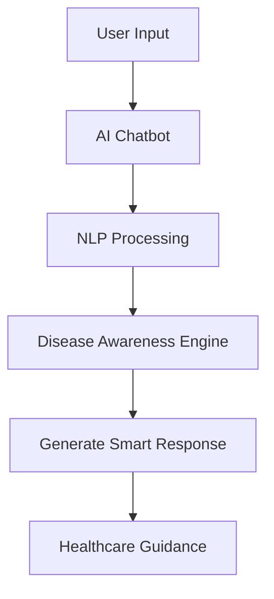

<div align="center">

# 🤖🌍 𝘼𝙄-𝘿𝙍𝙄𝙑𝙀𝙉 𝙋𝙐𝘽𝙇𝙄𝘾 𝙃𝙀𝘼𝙇𝙏𝙃 𝘾𝙃𝘼𝙏𝘽𝙊𝙏 🌍🤖


### 🩺 AI-Powered Disease Awareness & Public Healthcare Assistant

<br>


<br><br>


</div>

---

# 📌 About The Project

> **AI-Driven Public Health Chatbot for Disease Awareness** is an intelligent healthcare assistant designed to spread disease awareness and provide basic healthcare guidance using Artificial Intelligence and Natural Language Processing (NLP).

The chatbot helps users understand:

- 🩺 Disease symptoms
- 💉 Prevention methods
- 🌍 Public health awareness
- 📢 Healthcare education
- 🤖 AI-based healthcare interaction

This project aims to make healthcare information accessible, interactive, and user-friendly for everyone.

---

# ✨ Features

<div align="center">

| 🚀 Feature | 💡 Description |
|---|---|
| 🤖 AI Chatbot | Smart healthcare conversations |
| 🩺 Disease Awareness | Information about diseases & symptoms |
| 💉 Prevention Guidance | Health & safety recommendations |
| 🌍 Public Health Support | Spread healthcare awareness |
| 🗣️ NLP Integration | Human-like communication |
| 📱 Responsive Design | Mobile & desktop friendly |
| 🔍 Instant Responses | Fast chatbot interaction |
| 🌐 Multi-Language Ready | Expandable language support |

</div>

---

# 🛠️ Tech Stack

<div align="center">

| Technology | Purpose |
|---|---|
| 🐍 Python | Backend Development |
| ⚡ Flask / Django | Web Framework |
| 🤖 NLP | Language Processing |
| 🧠 AI/ML | Smart Response Generation |
| 🎨 HTML/CSS | Frontend Design |
| 💻 JavaScript | Interactivity |
| 🗄️ Database | Health Data Storage |

</div>

---

# 📂 Project Structure

```bash
Al-Driven-Public-Health-Chatbot-for-Disease-Awareness/
│
├── static/
│   ├── css/
│   ├── js/
│   └── images/
│
├── templates/
│
├── chatbot/
├── models/
├── dataset/
│
├── app.py
├── requirements.txt
└── README.md
```

---

# ⚙️ Installation

## 🔽 Clone Repository

```bash
git clone https://github.com/Abhijit-Bhattacharjee/Al-Driven-Public-Health-Chatbot-for-Disease-Awareness.git
```

## 📂 Open Project Folder

```bash
cd Al-Driven-Public-Health-Chatbot-for-Disease-Awareness
```

## 📦 Install Dependencies

```bash
pip install -r requirements.txt
```

## ▶️ Run Application

```bash
python app.py
```

---

# 🌍 Local Preview

```bash
http://localhost:5000
```

---

# 🔄 System Workflow



---

# 🎯 Objectives

- 🌍 Spread public health awareness
- 🩺 Provide basic healthcare guidance
- 📢 Reduce healthcare misinformation
- 🤖 Improve AI-based healthcare accessibility
- 💡 Create an interactive health assistant
- 📱 Make healthcare support easily accessible

---

# 🌍 SDG Alignment

<div align="center">

| SDG Goal | Contribution |
|---|---|
| 🩺 SDG 3 | Good Health & Well-Being |
| 🌍 SDG 10 | Reduced Inequalities |
| 🏗️ SDG 9 | Innovation & Infrastructure |

</div>

---

# 📸 Preview

<div align="center">


</div>

---

# 🚀 Future Enhancements

- 🎤 Voice-Based Chatbot
- 🌐 Multi-Language Support
- 🧬 AI Disease Prediction
- 📱 WhatsApp Integration
- ☁️ Cloud Deployment
- 📊 Healthcare Analytics Dashboard
- 🏥 Nearby Hospital Suggestions

---

# 🔐 Security & Privacy

```diff
+ Secure User Interaction
+ Protected Health Data
+ Encrypted Communication
+ Safe Information Handling
```

---

# 👨‍💻 Developer

<div align="center">

## 🚀 Abhijit Bhattacharjee

### 🌟 AI Developer | Healthcare Technology Enthusiast

GitHub: https://github.com/Abhijit-Bhattacharjee

</div>

---

# 🤝 Contribution

Contributions are always welcome ❤️

```bash
1. Fork Repository
2. Create Feature Branch
3. Commit Changes
4. Push To GitHub
5. Open Pull Request
```

---

# ⭐ Support

If you like this project:

🌟 Star this repository  
🍴 Fork this project  
📢 Share with others  

---

<div align="center">


# 💙 AI For Better Public Healthcare

### ✨ Building Smarter Healthcare Awareness Through Technology ✨

</div>
